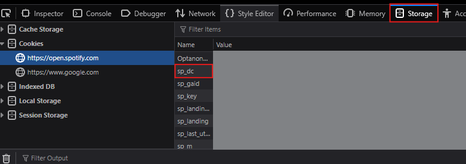
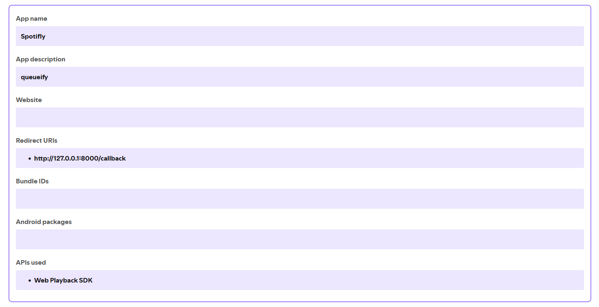

### ~\*~\*~ ♫ &nbsp;&nbsp;&nbsp; *queueify* &nbsp;&nbsp;&nbsp; ♫ ~\*~\*~

Twitch bot that handles Spotify song queuing for your stream with a handful of useful features <br />Disclaimer:  clanker helped me, yippie!

I tried to make this README as comprehensive as possible; please let me know if i should add anything for clarity!

### ✦・゜゜・✧ &nbsp;&nbsp;&nbsp; [Queueify OBS Widget Preview ](https://imgur.com/OpbsxM2) &nbsp;&nbsp;&nbsp; ✧・゜゜・✦
<br />

> [!NOTE]
Adding songs to playback queue requires Spotify Premium

> **Comprehensive list of all commands at the bottom!!**

### Features
- Displays an on-screen spotify widget so your viewers know what song is currently playing! (`Set this up with a browser source, more information below`)
- Supports Twitch Channel Point Redemptions as an alternative way to queue songs
- Lists the current queue with `!q`
- Auto-refunds channel point redemptions when:
    - user is on cooldown (queue delay)
    - same-song repeat block triggers
    - song is too long (maxSongLength)
- Uses Twitch EventSub WebSocket for real-time redemption handling
- Command to completely disable/enable the channel reward redemption (hides it from redemption list in chat `!rewardoff` and `!rewardon`)
- View the currently playing song with `!np`
- Prevents duplicate spam with per-user cooldowns and repeat-song blocking (a user can't queue the same song for [x] amount of time)
- Configurable max song duration limit `!duration <seconds>`
- Supports mod controls for opening/closing the queue, cooldowns, song duration, and blacklist management `view commands at bottom`
- Persists queue state, deny list, cooldown settings, repeat delay, and pending attribution in JSON files
- Automatically manages Spotify authentication tokens (access + refresh)


<br />

### Requirements

- [Node.js](https://nodejs.org/en/download) (download the .msi for windows)
- [OBS Studio](https://obsproject.com/download) (Streamlabs OBS etc. will prob work, didn't test it)
- [Spotify Premium](https://www.spotify.com/premium/) account (required for adding songs to playback queue)


## Setup

### 1. Clone and install dependencies (or download the zip file)

```sh
git clone https://github.com/conditionull/queueify.git
cd queueify
npm install
```
<br />

### 2. Environment variables

Copy the contents of `.env.example` file to `.env` and fill in your credentials:

```sh
cp .env.example .env
```

Your `.env` should contain:

```sh
TWITCH_BROADCASTER_USERNAME=
TWITCH_BOT_USERNAME=
TWITCH_ACCESS_TOKEN=
TWITCH_CLIENT_ID=

SPOTIFY_CLIENT_ID=
SPOTIFY_CLIENT_SECRET=
SPOTIFY_REDIRECT_URI=http://127.0.0.1:8000/callback
SPOTIFY_REWARD_NAME=Spotify Queue # this can be anything

OBS_WEBSOCKET_PASSWORD=
OBS_WEBSOCKET_PORT=4455
OBS_WEBSOCKET_IP=
OBS_SCENE=Gaming # match it to yours
OBS_SOURCE=Queueify # match it to yours

SP_DC=your_sp_dc_cookie_here # You must supply your sp_dc cookie from a logged-in Spotify session in your WEB browser. View the image below to know where it is. 
```

<details>
  <summary>[ Click to view where to find the SP_DC value ]</summary>
  Access the "Storage" tab on the spotify web page by pressing: (Shift + F9)
  
</details>

### Twitch Tokens
Get them from [twitchtokengenerator.com](https://twitchtokengenerator.com/)
<br />
When visiting the site, click the robot icon `Bot Chat Token` > then toggle the following scopes: `chat:read` `chat:edit`, `channel:read:redemptions`, `channel:manage:redemptions`, `user:read:chat`
<br />Then click `"Generate  Token!"`
<br /><br />
**((** the values below are located under `"Generated Tokens"` section on the website **))**
<br />
The `TWITCH_ACCESS_TOKEN` value is what you copy from `ACCESS TOKEN` on the website.<br />Add `CLIENT ID` value to your .env file as well. 

> [!NOTE]
If you wanted to use another account to send messages instead of your own, simply do the same process but logged into the other account when visiting twitch [twitchtokengenerator.com](https://twitchtokengenerator.com/)

### Spotify Application Creation
Create an app at [Spotify Developer Dashboard](https://developer.spotify.com/dashboard) to get your `Client ID` **and** `Client Secret`.<br />
Set the redirect-uri to `http://127.0.0.1:8000/callback` or the exact value you put for `SPOTIFY_REDIRECT_URI` in the .env file. `localhost` is no longer supported by Spotify's API. 
<details>
  <summary>[ Click to view working example ]</summary>
  
</details>

<br />

### 3. Spotify tokens
 
Run `node auth.js` from the project root to generate `spotify-token.json`:

```sh
node auth.js
```
Open the link it prints in your terminal, log in with Spotify, and it'll save your access token, refresh token, and expiry to `spotify-token.json`.

<br />

### 4. Create Custom Channel Reward
If you've done everything above, simply run in project root:
```sh
node reward.js
```

You can now mess with the rewards name, color, icon, description text, etc. in your twitch dashboard. If you recreate the reward manually with the same name, functionality will break. Use the command above instead^

### 5. Spotify Canvas Setup

Queueify includes support for Spotify Canvas videos in the widget.

The Canvas API is already included in the project. No separate install is required :D

Make sure your `.env` contains:

```env
SP_DC=your_sp_dc_cookie_here
```
(Info on where to get your `SP_DC` is already listed above^^)

> [!NOTE]
If you `don't want` the canvas video, then change "canvas" to "cover" in [properties.json](./widget/themes/default/properties.json)

### 6. Add Browser Source
1. In OBS, add a `Browser` source
2. Set the `URL` to: http://localhost:3001
3. `Width:` 680 `Height:` 192 
> [!NOTE]
If you encounter any issues, report an issue here on github and I'll respond asap

### 7. OBS Widget Position Setup (optional but recommended for convenience)
- (use case: Your mods and/or whitelisted users can move the widget from Twitch chat depending on the game you're playing or if blocking information)
- Add whitelisted users in `queueify/config/settings.json` <br />

The `!topright set` and `!bottomcenter set` commands require an OBS WebSocket connection.

Enable it in: **OBS → Tools → WebSocket Server Settings**<br />
Then set the corresponding `.env` variables that are listed above in this README:
```ini
OBS_WEBSOCKET_PASSWORD=
OBS_WEBSOCKET_PORT=4455
OBS_WEBSOCKET_IP=
OBS_SCENE=Gaming # match it to yours
OBS_SOURCE=Queueify # match it to yours
```

### 8. Start the bot

```sh
npm start
```

<br />

## Twitch Chat Commands

| Command | Who | Description |
|---|---|---|
| `!q <spotify_url>` | Everyone | Queue a Spotify track (defaults: `360sec` max song length, and `60sec` queue cooldown) |
| `!q` | Everyone | Show up to 10 queued songs |
| `!active` or `!np` | Everyone | Displays the currently playing song |
| `!qon` | Mods | Open the queue |
| `!qoff` | Mods | Close the queue |
| `!delay` | Mods | Show the current queue cooldown |
| `!delay <seconds>` | Mods | Change the queue cooldown |
| `!repeatdelay` | Mods | Show the same-user same-song block window |
| `!duration` | Everyone | View the max duration for a queuable song |
| `!duration <seconds>` | Mods | Change the max duration a song can be when queued |
| `!repeatdelay <seconds>` | Mods | Change the same-user same-song block window |
| `!deny <username>` | Mods | Block a user from queuing |
| `!allow <username>` | Mods | Unblock a user |
| `!rewardoff` | Mods | Disable channel reward |
| `!rewardon` | Mods | Enable channel reward |
| `!chatoff` | Mods | Disable chat queueing |
| `!chaton` | Mods | Enable chat queueing |
| `!topright set` or `!tr set` | Mods | Set the "topright" location. The location data will be saved in queue-settings.json|
| `!topright` or `!tr` | Mods + Whitelisted users | Move the spotify widget to the saved topright preset  |
| `!bottomcenter set` or `!bc set` | Mods | Set the "bottomcenter" location. The location data will be saved in queue-settings.json|
| `!bottomcenter` or `!bc` | Mods + Whitelisted users | Move the spotify widget to the saved  bottomcenter preset  |

> [!NOTE]
!bottomcenter and !topright command names don't really matter. Just treat them both as unique positions you can set for any position in OBS. e.g.: `!topright set` can be at the bottom left for the widgets location

You can customize command aliases by editing the `aliases` array in each command file under the `commands/` directory, for example:

```js
aliases: ['q', 'sr', 'add'],
```

`queue-settings.json` will generate once you set a value for the following commands: `delay`, `duration`, or `repeatdelay`. Otherwise, the default values will be used.

Queue open/closed state persists across restarts in `queue-state.json`. The queue deny list persists in `queue-blacklist.json`. Queue delay, maxSongLength, and repeat delay persist in `queue-settings.json`. Pending queued songs (viewed with `!queue`) persist in `queue-pending.json`, which is reconciled against Spotify's real queue. So if by chance, the streamer has the same song YOU queued in their OWN generated queue, the queued song won't be removed from the queue even if it ended. 

<br />

Thanks [Paxsenix0](https://github.com/Paxsenix0) for creating the [Spotify Canvas API](https://github.com/Paxsenix0/Spotify-Canvas-API) workaround used for canvas support <3


### Credit
~ You don't need to credit me, feel free to use it however you want!<br />
~ Maybe star this repo if you enjoyed using it :>
~ My twitch channel: [sadrobotsdontcry](https://www.twitch.tv/sadrobotsdontcry)

### License
This project is licensed under the [MIT License](LICENSE).