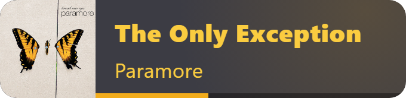
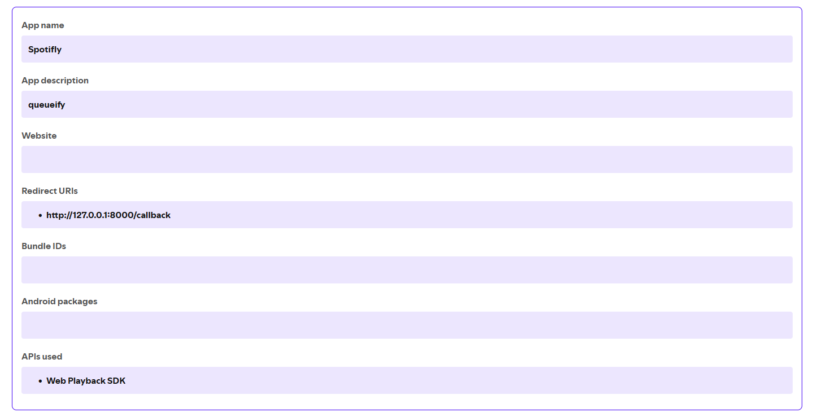
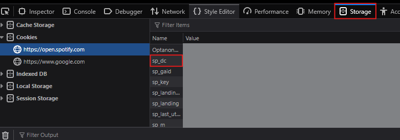

### ~\*~\*~ ♫ &nbsp;&nbsp;&nbsp; *queueify* &nbsp;&nbsp;&nbsp; ♫ ~\*~\*~

Twitch bot that handles Spotify song queuing for your stream with a handful of useful features <br />Disclaimer:  clanker helped me, yippie!

I tried to make this README as comprehensive as possible; please let me know if i should add anything for clarity!

### ✦・゜゜・✧ &nbsp;&nbsp;&nbsp; [Queueify OBS Widget Preview ](https://imgur.com/OpbsxM2) &nbsp;&nbsp;&nbsp; ✧・゜゜・✦
<br />

### OBS Widget Theme Previews



<br /><br />
> [!NOTE]
Adding songs to playback queue requires Spotify Premium

> **Comprehensive list of all commands at the bottom!!**

### Features

- On-screen Spotify widget that displays the currently playing song to viewers. (`Set this up with a browser source in OBS; see instructions below.`)
- Twitch Channel Point Redemptions as an optional second way to queue songs (Affiliate or Partner only - chat requests work on any channel)
- View the current queue with `!q`
- Automatic refunds for Channel Point Redemptions when:
  - The user is on cooldown
  - The same-song repeat block is active
  - The song exceeds the configured maximum length
  - And other various requirements set by the admin
- Real-time Channel Point Redemption handling through Twitch EventSub WebSocket
- Local tracks are supported by the OBS widget
- Enable or disable Channel Point song requests with `!rewardon` | `!rewardoff`
- View the currently playing song with `!np`
- Per-user cooldowns and repeat-song blocking to prevent queue spam
- Configurable maximum song duration with `!duration <seconds>`
- Explicit song filtering to allow or prevent explicit songs from being queued `!explicit on` | `!explicit off`
- Moderator controls for playback, the queue, cooldowns, song duration, and blacklist. (`See commands below.`)
- Persistent queue state, deny list, cooldown settings, repeat delay, and pending attribution stored in JSON files
- Automatic management of Spotify access and refresh tokens
- A setup dashboard that stays open while the bot runs, so accounts, OBS and the Spotify Canvas cookie can be changed without stopping anything
- An Admin Panel for the queue settings, command aliases and every line Queueify says in chat
- A visual theme editor: drag the album art, title, artist and progress bar around a canvas and save it as a real theme (`!theme <name>`)
- Themes can be exported to a file and shared with anyone else running Queueify
- The widget sizes itself to whatever space you give it in OBS, so it stays sharp at any size
- Nothing needs a restart: credentials, settings, aliases, messages and themes are all re-read while the bot runs

See [CHANGELOG.md](CHANGELOG.md) for what has changed, or open **What's new** on the dashboard.

<br />

### Requirements

- [Node.js 20 or newer](https://nodejs.org/en/download) (download the .msi for windows) - Queueify checks this on startup and says so if it is older
- [OBS Studio](https://obsproject.com/download) (Streamlabs OBS etc. will prob work, didn't test it)
- [Spotify Premium](https://www.spotify.com/premium/) account (required for adding songs to playback queue)

### Admin Panel

The dashboard has an Admin Panel at <http://127.0.0.1:3002/admin.html> covering the things people
used to edit by hand:

- **Settings** - cooldown, repeat block, maximum song length, whether chat and channel point
  requests are on, explicit tracks, whether the queue is open, and who may move the widget.
  Exactly what the chat commands do, applied immediately.
- **Commands** - rename any command or give it extra aliases, with a reset to the original.
- **Chat messages** - every line Queueify says, grouped and searchable. A message that drops a
  placeholder it needs is refused rather than going out broken.

Everything is written to the same files as before (`queue-settings.json`,
`config/aliases.json`, `config/messages.json`, `config/settings.js`), so editing those by hand
still works if you prefer.

### Chat messages and command aliases

Both live in **Admin Panel → Chat messages** and **Admin Panel → Commands**, searchable, with a
reset to the original wording beside each one. Changes apply while the bot runs.

Messages use placeholders like `{{username}}`, `{{artist}}` or `{{count}}` for the parts that
change; the panel shows which ones a message has to keep and refuses a change that drops one.

They are stored in [config/messages.json](config/messages.json) and
[config/aliases.json](config/aliases.json) if you would rather edit files - the same reload
applies, and a file that is missing or half-written falls back to the built-in wording rather
than interrupting the bot.

<details>
  <summary><strong>Already running an older version?</strong> (nothing to redo - click for the details)</summary>

<br />

Pull, run `npm install` (there are no new dependencies, but it keeps npm happy), then `npm start`.
It checks your saved Twitch login and reward on startup and opens the dashboard if anything
needs redoing. Nothing silently half-works.

**Nothing to redo.** Your Spotify connection, queue settings, blacklist, widget presets, themes
and `.env` are all kept as they are.

Three things happen by themselves the first time you run it:

- **Node 20 is now the minimum.** On anything older Queueify stops with a one-line message
  instead of a stack trace. Update Node and start it again.
- **Your OBS browser source is resized once**, to whatever the active theme is designed at, and
  the scene item is scaled by the matching amount. The widget stays exactly the same size on
  stream - it just renders at the right number of pixels instead of being stretched or squashed.
  Saved `!tr` / `!bc` presets are adjusted at the same time, so they still land where you set
  them.
- **`config/settings.js` is created for you** if you do not have one. The old
  `config/settings.example.js` is gone; there is nothing to copy or rename any more.

You may also notice that there is nothing left to configure by hand: the dashboard stays open
at `http://127.0.0.1:3002` for as long as the bot runs, and everything it writes is picked up
without a restart.

**Using your own Twitch application?** It keeps working. The dashboard offers a one-click switch
to the built-in one (no client ID or secret, logins renew themselves) - that requires
reconnecting Twitch and recreating the channel point reward once.

</details>

<br />

## Ports and other overrides

Queueify uses three local ports: `3001` for the widget, `3002` for the dashboard and `3000`
for the Canvas API. If the widget's or the Canvas API's port is taken, Queueify says which one
and stops rather than starting half-broken - usually that means it is already running in
another window. A dashboard already serving on its port is simply reused.

Ports are the one thing the dashboard cannot change, because it is served on one of them. Put
them in `.env` if the defaults clash with something else:

```ini
SETUP_PORT=3002            # the dashboard
QUEUEIFY_WIDGET_PORT=3001  # the widget, i.e. your OBS browser source URL
QUEUEIFY_CANVAS_PORT=3000  # the Canvas video helper
```

The dashboard link printed at startup, and the address Queueify puts in chat messages, both
follow `SETUP_PORT`.

## Setup

### 1. Clone and install dependencies

```sh
git clone https://github.com/conditionull/queueify.git
cd queueify
npm install
```

**Use `git clone` if you can.** Updating later is then `git pull` and you are done - your
settings, themes and logins stay where they are. Downloading the zip works just as well to
start with, but every update means downloading it again and moving your files across by hand.
[Git for Windows](https://git-scm.com/download/win) takes a minute to install and saves you
that every time.
<br />

### 2. Start it

```sh
npm start
```

That opens the dashboard at `http://127.0.0.1:3002` and it takes it from there:

| On the dashboard | What it does |
|---|---|
| **Twitch** | Approve Queueify on Twitch. Nothing to copy or paste. |
| **Spotify** | Paste a Client ID and Secret, then connect. |
| **Channel points** *(optional)* | Creates the reward viewers redeem to request a song. |
| **OBS** *(optional)* | Pick your scene and widget source from lists that come from OBS. |
| **Canvas videos** *(optional)* | Paste the `sp_dc` cookie for Spotify's looping clips. |

There is no configuration file to fill in - the dashboard writes everything Queueify needs.

Only Twitch and Spotify are needed. **Channel points are optional** - Twitch only allows reward
buttons on Affiliate and Partner channels, so if yours is not one of those, skip that step and
viewers request songs with `!q` as normal. You can add the reward later without reinstalling
anything.

The page stays up for as long as the bot runs, and the startup banner prints the link. Go back
to it whenever you need to reconnect an account, fix your OBS scene or source, or paste a new
Spotify cookie - changes apply on the next command, without stopping the bot.

> [!NOTE]
Whichever Twitch account you approve with is the account the bot chats as. It must be your broadcaster account or a moderator on your channel, or channel point redemptions won't work.

Spotify needs its own app (Spotify caps shared apps at 5 users), and the dashboard links you straight to it — create an app, set the Redirect URI to `http://127.0.0.1:8000/callback`, and paste the Client ID and Secret into the page.

<details>
  <summary>[ Click to view working example ]</summary>
  
</details>

<details>
  <summary>[ Click to view where to find the SP_DC value ]</summary>
  Access the "Storage" tab on the spotify web page by pressing: (Shift + F9)
  
</details>

### 3. Spotify Canvas videos (optional)

Spotify ships a short looping clip for a lot of tracks, and the widget can play it instead of
the album cover. Nothing to install - it needs one cookie.

Paste your `sp_dc` cookie into the **Canvas videos** step on the dashboard. It shows the same
screenshot as above and checks the cookie against Spotify, so an expired one is rejected there
rather than silently showing no videos later.

> [!NOTE]
Skip this and the widget shows album art. To turn the clips off for a theme, set **Album art**
to "Album cover only" in the theme editor.

### Make your own theme

The dashboard has a visual theme editor (**Widget themes → Open the theme editor**, or
<http://127.0.0.1:3002/editor.html>). Drag the album art, title, artist and progress bar around
a canvas, restyle them, and save — that writes a real theme folder under `widget/themes/`, so
it shows up in `!theme` straight away with no restart and no build step.

- **Start from a layout** rather than a blank canvas: Classic, Spotlight, Ticker or Stacked.
- Album art, title, artist and progress bar are always part of a theme, because the widget fills
  them in. Hide one rather than deleting it if a design does not need it - including the
  background panel, for a design that sits straight over gameplay.
- 50 fonts, gradients, glow, UPPERCASE and italic, and colors that follow the album art.
- Snapping like a design tool: edges and centers line up as you drag, resizing locks to another
  part's width or height, and moving locks to spacing you have already used. Hold <kbd>Ctrl</kbd>
  or <kbd>Shift</kbd> while dragging to turn it off.
- The preview is drawn by the same code that writes the theme, with your currently playing song
  when there is one, so what you see is what OBS gets.
- **Export** a theme to a file and **Import** one someone sent you. An import arrives as a new
  theme, so nothing you already have is overwritten.
- `default`, `minimal` and `swag` are hand-written and read-only, so there is always a known-good
  fallback. Duplicate one instead of editing it.
- Themes you make live in `widget/themes/` and are left alone by updates.

### 4. Add Browser Source
1. In OBS, add a `Browser` source
2. Set the `URL` to: http://localhost:3001
3. `Width:` 680 `Height:` 192

**Sharpness is not a setting.** Queueify renders each theme at the size it was designed at and
resizes the OBS browser source to match the space you have given it - when the bot starts, when
you switch theme, and whenever you drag the widget in OBS. It reloads the source for you too, so
opening OBS never needs a manual **Refresh**.

Set the source to `680` x `192` to start with; the numbers only matter until Queueify first
connects to OBS.

> [!NOTE]
If you encounter any issues, report an issue here on github and I'll respond asap

### 5. OBS Widget Position Setup (optional step)
- Use case: Your mods and/or whitelisted users can move the widget from Twitch chat depending on the game you're playing or if blocking information

The `!topright set` and `!bottomcenter set` commands require an OBS WebSocket connection.

Two steps, and only the first one is in OBS:

1. Turn the server on: **OBS → Tools → WebSocket Server Settings**, then **Show Connect Info**.
2. Open the **OBS** step on the dashboard (`http://127.0.0.1:3002`, or `npm run setup` if the
   bot is not running), paste the connect info, and pick your scene and the widget source from
   the dropdowns.

The scene and source lists come from OBS itself. Changing them later takes effect
on the next command, without stopping the bot.

Viewers who may move the widget without being mods go in **Admin Panel → Settings → Whitelist**.

> [!NOTE]
if the OBS widget does not show on startup, `Refresh` the source in OBS

<br />

## Twitch Chat Commands

The dashboard has a **Chat commands** card with the same list, searchable, showing who may
run each one and any aliases you have renamed in `config/aliases.json`.

| Command | Who | Description |
|---|---|---|
| `!q <spotify_url>` | Everyone | Queue a Spotify track (defaults: `360sec` max song length, and `60sec` queue cooldown) |
| `!q` | Everyone | Show up to 10 queued songs |
| `!active` or `!np` | Everyone | Displays the currently playing song |
| `!skip` | Mods | Skips to the next Spotify track (requires Spotify Premium) |
| `!qon` | Mods | Open the queue |
| `!qoff` | Mods | Close the queue |
| `!delay` | Mods | Show the current queue cooldown |
| `!delay <seconds>` | Mods | Change the queue cooldown |
| `!repeatdelay` | Mods | Show the same-user same-song block window |
| `!duration` | Everyone | View the max duration for a queuable song |
| `!duration <seconds>` | Mods | Change the max duration a song can be when queued |
| `!repeatdelay <seconds>` | Mods | Change the same-user same-song block window |
| `!deny <username>` | Mods | Block a user from queuing |
| `!allow <username>` | Mods | Unblock a user |
| `!blockartist <artist_name>` | Mods | Block songs by an artist, including featured artists |
| `!blocksong <spotify_url>` | Mods | Block a specific Spotify song |
| `!unblockartist <artist_name>` | Mods | Unblock an artist |
| `!unblocksong <spotify_url>` | Mods | Unblock a specific Spotify song |
| `!rewardoff` | Mods | Disable the Spotify song request channel point reward |
| `!rewardon` | Mods | Enable the Spotify song request channel point reward |
| `!chatoff` | Mods | Disable chat queueing |
| `!chaton` | Mods | Enable chat queueing |
| `!topright set` or `!tr set` | Mods | Set the "topright" location. The location data will be saved in queue-settings.json|
| `!topright` or `!tr` | Mods + Whitelisted users | Move the spotify widget to the saved topright preset  |
| `!bottomcenter set` or `!bc set` | Mods | Set the "bottomcenter" location. The location data will be saved in queue-settings.json|
| `!bottomcenter` or `!bc` | Mods + Whitelisted users | Move the spotify widget to the saved  bottomcenter preset  |
| `!theme <minimal,swag,default>` | Mods | Change widget themes --> e.g.: `!theme swag` |
| `!explicit on` or `!explicit off` | Mods | Allow or prevent explicit songs from being queued |


> [!NOTE]
!bottomcenter and !topright command names don't really matter. Just treat them both as unique positions you can set for any position in OBS. e.g.: `!topright set` can be at the bottom left for the widget's location

<details>
  <summary>[ Click to view additional details about queueify functionality ]</summary>

Each widget theme has their own !bc and !tr position. So make sure to set unique positions for each theme (if you're using the positional commands)

`queue-settings.json` will generate once you set a value for the following commands: `delay`, `duration`, or `repeatdelay`. Otherwise, the default values will be used.

Queue open/closed state persists across restarts in `queue-state.json`. The queue deny list persists in `queue-blacklist.json`. Queue delay, maxSongLength, and repeat delay persist in `queue-settings.json`. Pending queued songs (viewed with `!queue`) persist in `queue-pending.json`, which is reconciled against Spotify's real queue. So if by chance, the streamer has the same song YOU queued in their OWN generated queue, the queued song won't be removed from the queue even if it ended.

</details>

<br />

Thanks [Paxsenix0](https://github.com/Paxsenix0) for creating the [Spotify Canvas API](https://github.com/Paxsenix0/Spotify-Canvas-API) workaround used for canvas support <3


### Credit
- You don't need to credit me, feel free to use it however you want!<br />
- Maybe star this repo if you enjoyed using it :>
- My twitch channel: [sadrobotsdontcry](https://www.twitch.tv/sadrobotsdontcry)

### Support

Queueify is free and always will be. If it saved you some hassle, you can
[buy me a coffee](https://buymeacoffee.com/bobabeans) <3

### License
This project is licensed under the [MIT License](LICENSE).
